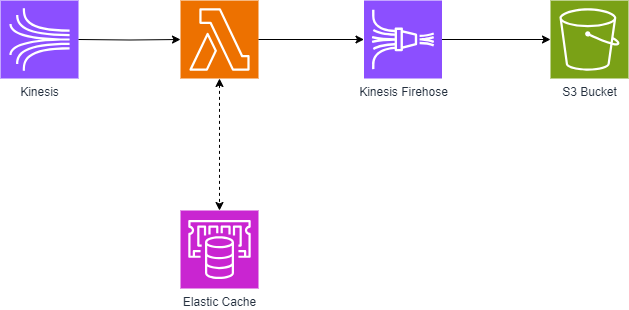

# Understanding Apache Flink’s Role in Modern Data Processing

In the rapidly evolving world of data processing and analytics, businesses and developers continually seek more efficient, scalable, and cost-effective solutions. Apache Flink has been a strong player in the field of real-time data processing. However, the emergence of cloud-native technologies like Redis, AWS Lambda, and the combination of SQS and Kinesis presents a compelling case for organizations to reevaluate their data processing architectures.

## Apache Flink

Apache Flink is an open-source, unified stream-processing and batch-processing framework. It excels in real-time data processing, offering high throughput and low latency. However, Flink can be complex to set up and maintain, and it often requires a significant infrastructure investment.

## Advantages of Redis and AWS Lambda in Data Processing

Redis, an in-memory data store, and AWS Lambda, a serverless computing service, offer distinct advantages:

- **Scalability and Performance**: Redis provides ultra-fast performance due to its in-memory nature, making it ideal for real-time analytics. AWS Lambda, with its serverless architecture, can automatically scale based on the workload, eliminating the need for manual scaling.

- **Cost Efficiency**: With AWS Lambda, you pay only for the compute time you consume, reducing the cost for idle resources. Redis, when managed through cloud providers, can also be more cost-effective compared to maintaining dedicated Flink clusters.

- **Ease of Management**: Serverless architectures like Lambda reduce the operational burden as there is no need to manage servers or clusters. Redis cloud solutions offer similar benefits, simplifying data management without sacrificing performance.

## Example System Overview

In this streamlined example, data flows from Amazon Kinesis Stream to AWS Lambda and then to Kinesis Firehose. Kinesis Stream captures real-time data, which triggers Lambda functions for on-the-fly processing. Finally, processed data is transferred to Kinesis Firehose for reliable loading into storage or analytics destinations. This setup demonstrates a modern, serverless, and efficient approach to real-time data processing in the cloud.

## Sample Code
- [CDK Stack](https://github.com/meni432/redis-article/blob/main/redis/lib/redis-stack.ts)
- [Lambda code example](https://github.com/meni432/redis-article/blob/main/redis/lambda/index.js)

## Conclusion

While Apache Flink remains a robust solution for certain use cases, the integration of Redis, AWS Lambda, SQS, and Kinesis offers a modern, streamlined, and cost-effective approach for many data processing needs. This combination simplifies infrastructure management, enhances scalability, and can lead to significant cost savings, making it an attractive option for businesses looking to optimize their data processing capabilities.

In conclusion, the shift towards a combination of Redis, AWS Lambda, SQS, and Kinesis represents not just a technological change, but a strategic move towards a more agile, efficient, and scalable data processing paradigm. This transition aligns with the evolving demands of real-time data processing and analytics, ensuring businesses are well-equipped to handle the challenges of modern data requirements.
